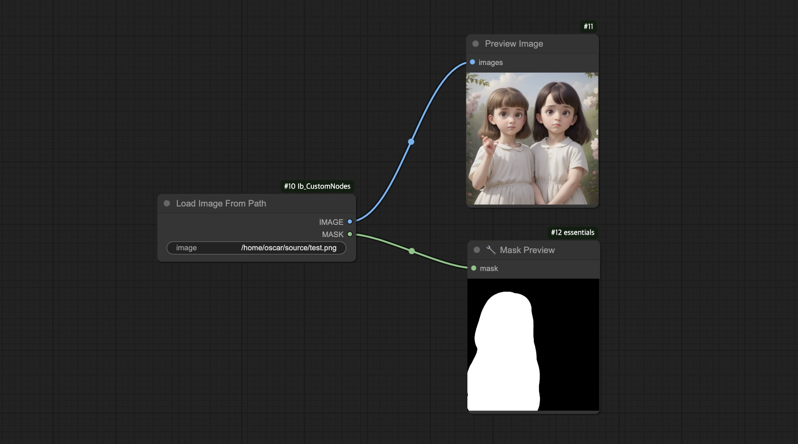

# ComfyUI_Ib_CustomNodes
## Load Image From Path
```python
def LoadImageFromPath(
    image: str = r'ComfyUI_00001_-assets\ComfyUI_00001_.png [output]'
) -> tuple[Image, Mask]
```

ComfyUI's built-in `Load Image` node can only load uploaded images, which produces duplicated files in the input directory and cannot reload the image when the source file is changed. `Load Image From Path` instead loads the image from the source path and does not have such problems.

One use of this node is to work with Photoshop's [Quick Export](https://helpx.adobe.com/photoshop/using/export-artboards-layers.html#:~:text=in%20Photoshop.-,Quick%20Export%20As,-Use%20the%20Quick) to quickly perform img2img/inpaint on the edited image. Update: For working with Photoshop, [comfyui-photoshop](https://github.com/NimaNzrii/comfyui-photoshop) is more convenient and supports waiting for changes. See [tutorial at r/comfyui](https://www.reddit.com/r/comfyui/comments/18jygtn/new_ai_news_photoshop_to_comfyui_v1_is_finally/).

The image path can be in the following format:
- Absolute path:

  `D:\ComfyUI\output\ComfyUI_00001_-assets\ComfyUI_00001_.png`

- Relative to the input directory:

  `ComfyUI_00001_-assets\ComfyUI_00001_.png [input]`

- Relative to the output directory:

  `ComfyUI_00001_-assets\ComfyUI_00001_.png [output]`

- Relative to the temp directory:

  `ComfyUI_00001_-assets\ComfyUI_00001_.png [temp]`

## Installation
Install via the Custom Nodes Manager in [ComfyUI-Manager](https://github.com/ltdrdata/ComfyUI-Manager).

## Usage Example


## PIL.Image
```python
def PILToImage(
    images: PilImage
) -> Image
```
```python
def PILToMask(
    images: PilImage
) -> Image
```
```python
def ImageToPIL(
    images: Image
) -> PilImage
```
Mainly for use with [ComfyScript](https://github.com/Chaoses-Ib/ComfyScript)'s real mode.